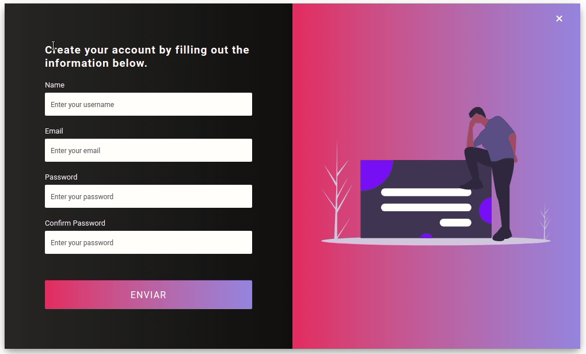

# React Form - React

> This project was made using **React**, **HTML**, **CSS** and **JavaScript-Vanilla**. The objective was to learn how to validade a form, also I used hooks to deal with inputs.

## How to Run this Project

- git clone https://github.com/joaorpereira/react-form.git
- npm install
- npm start

## Versions

- node: v12.18.3

## Reference Material

- <a href="https://www.youtube.com/watch?v=I2UBjN5ER4s" target="_blank">React Website Tutorial - Brian Design</a>

## License

- **[MIT license](http://opensource.org/licenses/mit-license.php)**
